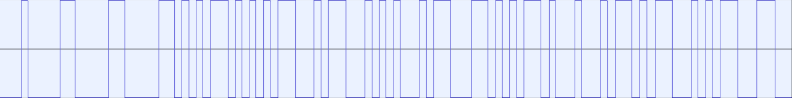

# Data Stream Format For The Omni Entertainment System

- [Instruction Booklets](https://archive.org/download/Omni_System/)
- [Other Omni Entertainment System Stuff](https://archive.org/search?query=Omni+Entertainment+System)

## The Reader
The Following Are Signals For the Decoder
- 2 Pulldown Clicks: Enable Reader
- 1 Pullup Click: Start Reading and Mute Audio
- 1 Pulldown Click: Stop & Process
- 2 Pullup Clicks: Disable Reader and Unmute
- Some Tapes do Up Down Up for start and Down Down Up for stopping

Bits are encoded with FM with freqency range of 900 to 3000hz, The Encoding within is unknown

When the Reader is enabled and reading, there should not be any other audio clips

## The Omni
### Start
The Omni Will Scan Both Channels For a `Round Ready` Message. Once Found, Audio Will Play Out of the Channel where that message was found. If the command was on the left, the left channel will activate.

Holding Enter When Inserting a Tape Disables the decoder entirely and mixes both channels, Reperposing it as an 8 track player

### During Rounds
The Omni will play audio out of one channel only, The Omni Will Play However Many Rounds The Cartage Specifies, This Is Counted On `Round Ready`, Not `Question Prompt`

### Endgame
Once the set number of rounds has been reached, or an `End Game` Is encountered, the Playhead continues, until a `Round Ready` Is found

## Opcodes
The Data Stream is used as Opcode Operand, after the initial pattern
Opcodes are One Digit
Operands can be whatever long it wants

A Data Stream May Embed Multiple Instructions

|Opcode|Operands|Name|Action|
|------|----|----|------|
|?|None|Yeild Until `Prompt/GO`|Halts The Playhead and Sound until the `Promt/GO` Button is pressed, The unit will also beep every 30 seconds to signal this|
|?|The Answer, Encoded as numbers 0-9|Set Answer|Sets The Answer, Does nothing until `Prompt Answers` Is ran|
|?|None|Stop Accepting|Stops Accepting Answers, This Will Turn The Displays To The Current Score|
|?|Scores as 4 digits, subtracted from 11|Set Scores|Configures Scores For the Next question, Scores are fastest to slowest, based on the FIRST Key Press, Not Enter|
|?|Minimum Score as number|Prompt Answers|Prompts For Answers, This Blinks `--` On their displays, Stays Blank if Condition Not met
|?|None|Flash Winner|Flashes the display with the highest score,
|?|None|Update Scores|Updates the Scores
|?|Enables, each bit is a player|Set Display Status|Turns Displays Off, Omni Ignores Non-signed in player displays|
|?|None|End Game|Overrides the counter and ends the game, Will Also Play Victory Sound|
|?|Type, Number Of Questions|Round Ready|Setup a round, This Blinks `00` on their displays ready for signing in using the `Enter` Key|
|?|Audio Channel, Data Channel|Set Channels|Sets The Channels The System will play off, if the channels are the same, data bursts will mute the audio